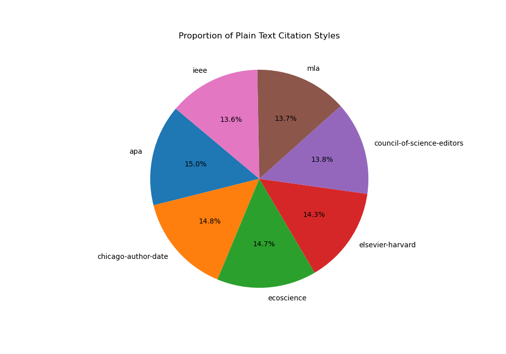
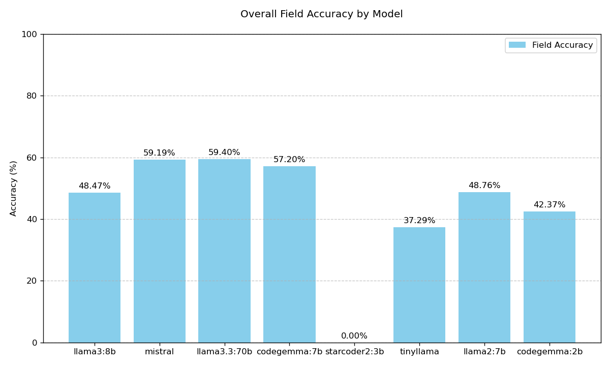
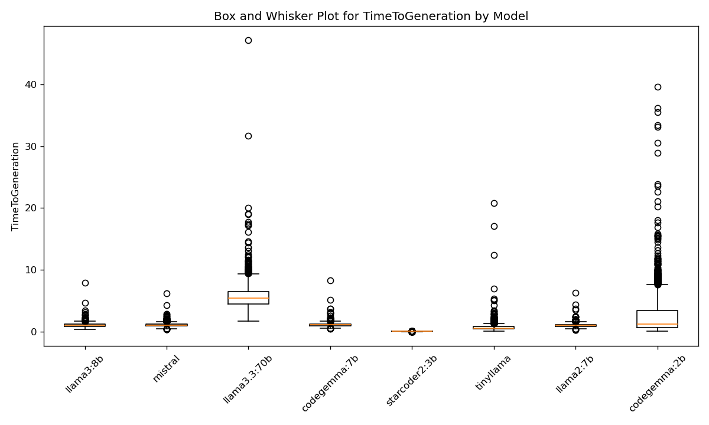
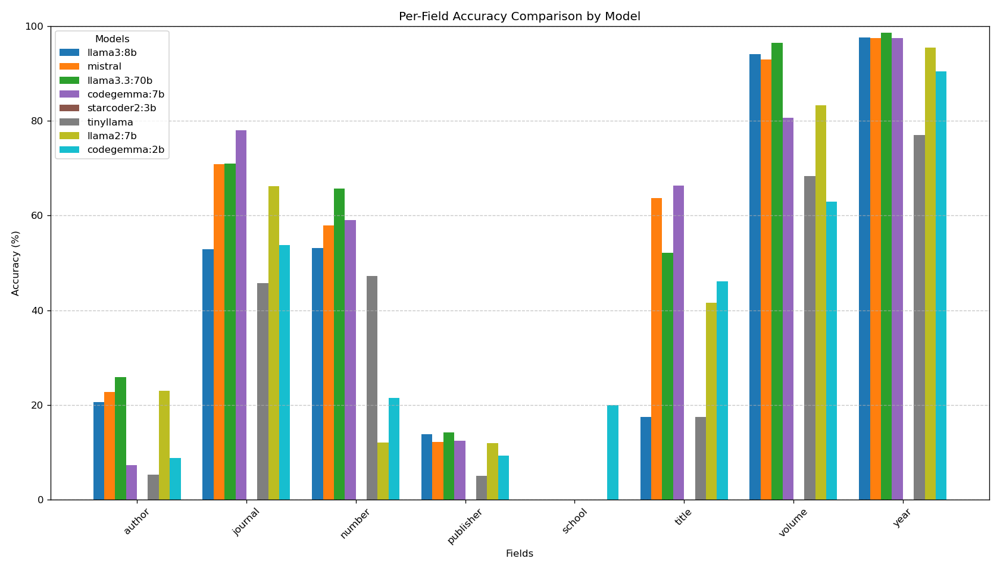

## About the Author

Aerith Y. Netzer is the Digital Publishing and Repository Librarian at Northwestern University in Evanston, Illinois.

## Background and Motivation

University-owned journal-publishing operations operate under far tighter
economic constraints---direct and opportunity---and therefore must
solve the same problems of corporate academic publishers with a fraction
of the resources available.[@acrl2024] [@relxMarketSegments2023]One of these problems is reference metadata,
i.e., machine-actionable references that are then used to count citations
of articles. The act of capturing, counting, and using citations
accurately allows for funding agencies, universities, and publishers to
make data-driven decisions for funding allocation, allows for reviewers
to validate the research of a manuscript, and allows for faster
literature review.

### An Example

The workflow for our university---a medium-size, elite university in the
Mid-west United States---consists of receiving manuscripts from
authors in a Microsoft Word file format. We then use pandoc
[@PandocIndex] to transform this Word document to a markdown file
format, from which we can build PDF and Web versions from a single
source. But due to author unwillingness to use plaintext markup formats
such as LaTeX or Markdown, we must recreate the bibliography.
Previously, this meant looking up each source, adding them to a
Zotero[@ZoteroYourPersonal] library, and then exporting the BibTeX
file for use as metadata in the web version of the article. As Northwestern's
journal-publishing operation is a one-woman show and quickly growing in complexity
and scope, we found it necessary to find a way to find a faster way.

There have been many projects aimed to converting plain-text to BibTeX
using programmatic means, but are often limited to certain languages [@MakinoTakakisPage] or
are dependent upon external data [@Text2bib]. As Large Language Models grew popular,
we originally reached for the most popular option --- the GPT-3 and 3.5 API.
However, it just seemed *wrong* to implement a closed-source large language model into
our heretofore completely open-source publishing stack. Thus, we reached for another,
more open, tool --- Ollama.

### Limitations and Concerns

This analysis is---by necessity---is limited to works that appear in the
crossref API, creating a bias in the dataset against older works and
academic monographs. While this limits the usefulness of this analysis to
publishers whose specialty lies within fields where citations are limited
to recent works (such as the physical sciences), future work can and
should include plain-text citations of historical, non-digital, and non-academic
works.

Along with the rapid growth in users of Large-Language models, so have
concerns over the ecological sustainability of LLM
technology.[@dingSustainableLLMServing2024]
[@chienReducingCarbonImpact2023] Most of these concerns, however, can be
alleviated with the use of \"small\" models such as those provided by
Ollama. Further, there are concerns about the validity of Large-Language
models, especially concerning their propensity to hallucinate. However,
in combination with validity checkers such as bibtexparser and human
review, we are confident enough in this system to be used in production
of our journals.[@JournalBulletinApplied] Future work in this area should
include building scalable, verifiable workflows that do not necessitate
human oversight.

## Methodology

### Data Collection

Data was collected via the CrossRef API [@bartellRESTAPI]. We sampled a DOI
and randomly selected a plain-text citation style from the following list:

1. Chicago Author-Date
2. Elsevier-Harvard
3. Ecoscience
4. APA
5. MLA
6. IEEE
7. Council of Science Editors

Using the CrossRef API, we pulled the BibTex Citation, the Plaintext
Citation, and the DOI to create a dataset for our analysis. [Table 1]
presents the variables and their descriptions.

Table 2: Citation Metadata

| Variable | Description |
| -------------- | --------------- |
| DOI | The Digital Object Identifier of the requisite work. |
| BibTeX Citation | Metadata about the work in BibTeX format. |
| Plain Text Citation | The cited work in a given citation style. |
| Plain Text Citation Style | The style in which the plain text citation is given. |

To fairly analyze the performance of each language model on a broad set of citation
formats, each variable was randomly assigned one of the above citation styles and
returned by the CrossRef content negotiation API endpoint. Using this random assignment
of citation formats, we achieved a roughly even distribution of each citation style in
the dataset.



### Analysis

All language models were tested using the Ollama[@OllamaOllama2025] toolkit using the
Quest [@QuestHighPerformanceComputing] supercomputing cluster at Northwestern University,
running in a singularity container.[@kurtzerSingularityScientificContainers2017] Testing
of all models took 14 hours to complete on two NVIDIA A100 Graphical Processing Units,
one node with eight cores, and 128 gigabytes of memory.[^1][^2] All code was written in
python using an Anaconda environment to aid in reproducible deployments of this code.

We used the plain text citation given by the CrossRef API as a ground truth to which
the model would aspire to. We prompted each model with the same text:

>You are a professional citation parser.
>
>Given the following plain text citation:
>
>{plain_text_citation}
>
>Please convert this citation into a structured BibTeX entry.
>Include all relevant fields such as author, title, journal,
>volume, pages, year, etc.
>
>Output only the BibTeX entry, and nothing else. Do not
>include any explanations, preambles, or additional text.

The following models were prompted:

1. codegemma:2b[@codegemma_2024]
2. codegemma:7b[@codegemma_2024]
3. llama2:7b[@touvronLlama2Open2023]
4. llama3.3:70b[@llama3modelcard]
5. llama3:8b[@llama3modelcard]
6. mistral:7b[@Mistral]
7. starcoder2:3b[@li2023starcoder]
8. tinyllama[@zhang2024tinyllama]

These models were chosen to represent a range of model sizes and training methods.

The following variables were saved to the output file of the model:

| Variable                | Description                                                                 |
|----------------------|-----------------------------------------------------------------------------|
| Model                | The model being tested. One of the eight models listed above.               |
| PlainTextCitation    | Maps to plain text citation field table 1.                                  |
| TimeToGeneration     | Time taken to generate the entry.                                           |
| ActualBibTeX         | BibTeX entry retrieved from Crossref.                                       |
| TotalFields          | The number of BibTeX fields being compared in generated and "ground truth" entries. |
| Matching Fields      | The number of fields that have a match in both the generated and "ground truth" entries. |
| Percentage Match     | $\frac{\text{Total Fields}}{\text{Matching Fields}}$                       |

This generated 8 CSV files of approximately 3,000 lines each. Each row corresponds to a single DOI. These files
were used for analyzing the efficiency and effectiveness of each model.

\newpage

## Results

### Model Effectiveness



Unsurprisingly, llama3.3:70b, the most advanced and largest model of the chosen models,
performed the best. Further, starcoder2:3b failed to create any valid BibTeX entries, whereas
every other model created valid BibTeX for every citation.



\newpage

| Model               | Median Time to Generation (seconds) | Standard Deviation (seconds) |
|---------------------|-------------------------------------|------------------------------|
| codegemma:2b        | 1.18                                | 3.24                         |
| codegemma:7b        | 1.08                                | 0.29                         |
| llama2:7b           | 0.96                                | 0.27                         |
| llama3.3:70b        | 5.45                                | 1.90                         |
| llama3:8b           | 1.00                                | 0.31                         |
| mistral             | 1.00                                | 0.27                         |
| starcoder2:3b       | 0.00                                | 0.00                         |
| tinyllama           | 0.57                                | 0.64                         |

As every model except for starcoder2:3b created valid BibTeX perfectly, we are primarily concerned
with and the accuracy of the fields. In this discussion, the *validity* of the BibTeX simply means that if the BibTeX can be parsed without errors, then the BibTeX is valid. However, a well-formed BibTeX entry can be *valid*
but *incorrect*. Meaning that the entry can be parsed, but the data in the entry is wrong.
But llama3.3:70b generated the most *accurate* BibTeX entries. However, we should not take this that the model was necessarily *incorrect*, but was just different from how Crossref represented the field.
Mistral and Codegemma, though, are very close behind, especially with their parameter sizes (and therefore cost of compute)
much lower than llama3.3:70b, it may be economical for some publishing operations to use smaller models, decreasing their
cost, while keeping parity with the accuracy of the model. Trading a .2% reduction in accuracy for, on average, a 5x faster computation is an effective strategy for this use case.

\newpage

### Per-Field Accuracy



All models were very accurate in producing volume, year, and journal entries in BibTeX, while author, publisher, and school were the least accurate fields. This is because there is greater freedom and flexibility in how these fields are entered, and thus a correct and valid generated BibTeX need not be exactly the same as Crossref's representation of the same data. Future work should include creating a validator to identify equivalent author, publisher, and school names.

For example, consider the following BibTeX entries:

> {National Academy of Sciences, The}

> {The National Academy of Sciences}

While these entries refer to the same entity, they cannot be identified as the same programmatically, and are thus penalized as "inaccurate." Thus, the results in Figure 2 should be interpreted as the models' accuracy when using Crossref as the metric of accuracy. This analysis is useful because it shows which models are better-suited for this task, rather than the concluding 50% of the fields to be incorrect.

## Following Along at Home

While we ran these models on a supercomputer to aid in analysis. Models with parameter sizes of less than 10 billion can be run on consumer hardware.
We recommend a computer with a dedicated, modern GPU (verified to work on the author's personal Nvidia 3080Ti, AMD Ryzen 6-core CPU, and 32 GB of RAM, and a top-of-the-line MacBook Pro M4 Series)

For UNIX Systems, use cURL to install Ollama with one command:

`curl -fsSL https://ollama.com/install.sh | sh`

Then pull the model (we recommend mistral):
`ollama pull mistral`

Then, start an Ollama server listening on port 11434:

```py
def generate_text_with_ollama(model_name, prompt):
    url = 'http://localhost:11434/api/generate'
    payload = {
        "model": model_name,
        "prompt": prompt,
        "temperature": 0,  # Make output more deterministic
        "stop": ["\n\n"]
    }
    headers = {
        "Content-Type": "application/json"
    }
    response = requests.post(url, headers=headers,
                             data=json.dumps(payload), stream=True)

    # Handle streaming response
    generated_text = ''
    for line in response.iter_lines():
        if line:
            data = json.loads(line)
            if data.get('done', False):
                break
            else:
                generated_text += data.get('response', '')

    return generated_text.strip()
```

You can then use pass any input you like to this function and return a generated BibTex Key. Full code sample
is in the author's GitHub repo.

## Conclusion

For university-owned publishers, small, locally-available LLMs are capable of producing well-formed BibTeX.
These models can be used to create machine-actionable citation metadata, automating a step in the publishing process.
As of the publication of this paper, 7 billion parameter models, especially mistral, are capable of running on the latest laptops, and provide good performance at the least cost.

## Data and Code Availability

The author strives to adhere to the FAIR guiding principles. Code and data used for this analysis is available on GitHub.[@AerithnetzerBiblatextransformer]

\newpage

## Bibliography {#bibliography .unnumbered}

[^1]: The script used to create the SLURM job can be found in the GitHub repository mentioned in the "Data and Code Availability" section.
[^2]: Thank you to Kat Nykiel at Purdue University for her assistance in building and deploying the singularity container.
